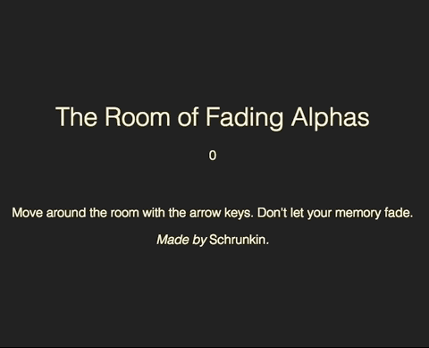

# The Room of Fading Alphas, LD 37

A game about opacity. The theme was "One Room". 

This entry is made by me and my friend Jakob. Play it here: https://grunkgrunk.github.io/.

The jam-entry: http://ludumdare.com/compo/ludum-dare-37/?action=preview&uid=113447.
